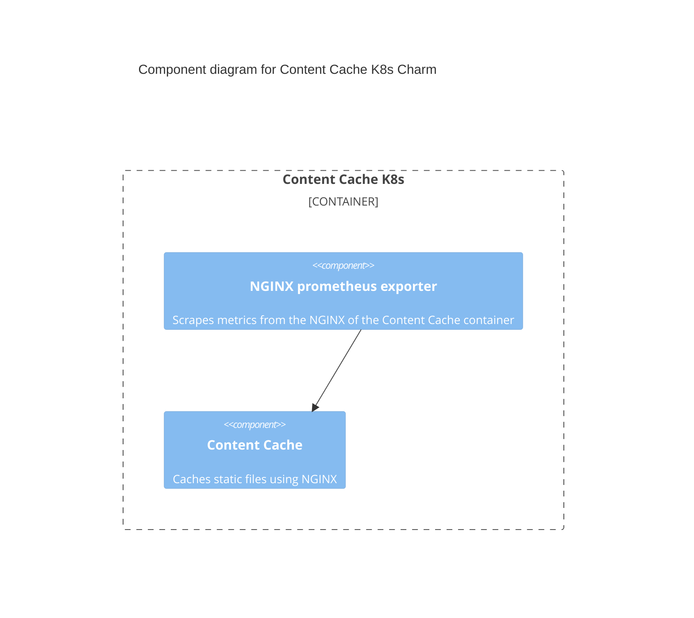
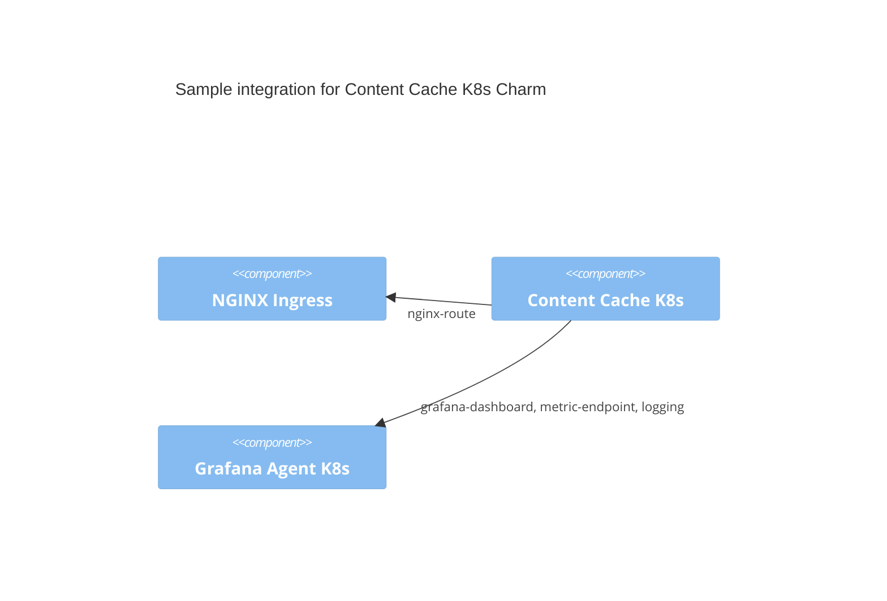

# Charm architecture

At its core, Content-cache-k8s is a NGINX cache application that helps another charm serving static content for it.

The charm design leverages the [sidecar](https://kubernetes.io/blog/2015/06/the-distributed-system-toolkit-patterns/#example-1-sidecar-containers) pattern to allow multiple containers in each pod with [Pebble](https://juju.is/docs/sdk/pebble) running as the workload container’s entrypoint.

Pebble is a lightweight, API-driven process supervisor that is responsible for configuring processes to run in a container and controlling those processes throughout the workload lifecycle.

Pebble `services` are configured through [layers](https://github.com/canonical/pebble#layer-specification), and the following containers represent each one a layer forming the effective Pebble configuration, or `plan`:

1. An [NGINX](https://www.nginx.com/) container with caching features, which can be used to efficiently serve static resources, as well as be the incoming point for all web traffic to the pod. This is the content cache container itself.
2. A [NGINX Prometheus Exporter](https://github.com/nginxinc/nginx-prometheus-exporter) container that can be used to provide statistics on web traffic.

As a result, if you run a `kubectl get pods` on a namespace named for the Juju model you've deployed the Content-cache-k8s charm into, you'll see something like the following:

```bash
NAME                             READY   STATUS    RESTARTS   AGE
content-cache-k8s-0              3/3     Running   0          97s

```

This shows there are three containers - the two named above, as well as a container for the charm code itself.

And if you run `kubectl describe pod content-cache-k8s-0`, all the containers will have as Command ```/charm/bin/pebble```. That's because Pebble is responsible for the processes startup as explained above.

## Containers

Configuration files for the containers can be found in [the files directory of the charm repository](https://github.com/canonical/content-cache-k8s-operator/tree/main/files) and in [the templates directory of the charm repository](https://github.com/canonical/content-cache-k8s-operator/tree/main/templates).



### Content cache

This container is the entry point for all web traffic to the pod (on port `80`). Serves static files directly.

The workload that this container is running is defined in the [Content-cache rock in the charm repository](https://github.com/canonical/content-cache-k8s-operator/blob/main/content-cache_rock/rockcraft.yaml).

### NGINX prometheus exporter

This container runs the `nginx/nginx-prometheus-exporter` image.

The `NGINX Prometheus Exporter` is started with `-nginx.scrape-uri=http://localhost:9080/stub_status` so will scrape metrics from the NGINX container.

This has been configured in the NGINX container to return NGINX's [stub_status](http://nginx.org/en/docs/http/ngx_http_stub_status_module.html). The exporter listens on port `9113` and metrics about web traffic to the pod can be scraped by Prometheus there.

## Docker images

The image defined in [Content-cache dockerfile](https://github.com/canonical/content-cache-k8s-operator/blob/main/content-cache.Dockerfile) in the charm repository is published to [Charmhub](https://charmhub.io/), the official repository of charms.

This is done by publishing a resource to Charmhub as described in the [Juju SDK How-to guides](https://juju.is/docs/sdk/publishing).

## Integrations

See [relation endpoints](https://charmhub.io/content-cache-k8s/docs/reference-integrations).

The Content Cache K8s charm supports various integrations to provide additional functionality.

It is possible for a type of integration to be fulfilled by multiple types of charms.
Below is a diagram of a basic Content Cache deployment with some sample charms to fulfill each integration.



## Juju events

For this charm, the following events are observed:

1. [<container name>_pebble_ready](https://juju.is/docs/sdk/container-name-pebble-ready-event): fired on Kubernetes charms when the requested container is ready.
Action: wait for the integrations, and configure the containers.
2. [config_changed](https://juju.is/docs/sdk/config-changed-event): usually fired in response to a configuration change using the CLI.
Action: wait for the integrations, validate the configuration, update Ingress, and restart the containers.
3. [report_visits_by_ip](https://charmhub.io/content-cache-k8s/actions): fired when report-visits-by-ip action is executed.
Action: Report the amount of visits grouped by IP that have visited the service ordered by amount of visits.

## Charm code overview

The `src/charm.py` is the default entry point for a charm and has the ContentCacheCharm Python class which inherits from CharmBase.

CharmBase is the base class from which all Charms are formed, defined by [Ops](https://juju.is/docs/sdk/ops) (Python framework for developing charms).

See more information in [Charm](https://juju.is/docs/sdk/constructs#heading--charm).

The `__init__` method guarantees that the charm observes all events relevant to its operation and handles them.

Take, for example, when a configuration is changed by using the CLI.

1. User runs the command:
```bash
juju config content-cache-k8s backend="http://mybackend.local:80"
```
2. A `config-changed` event is emitted.
3. In the `__init__` method is defined how to handle this event like this:
```python
self.framework.observe(self.on.config_changed, self._on_config_changed)
```
4. The method `_on_config_changed`, for its turn, will take the necessary actions such as waiting for all the relations to be ready and then configuring the containers.